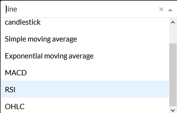
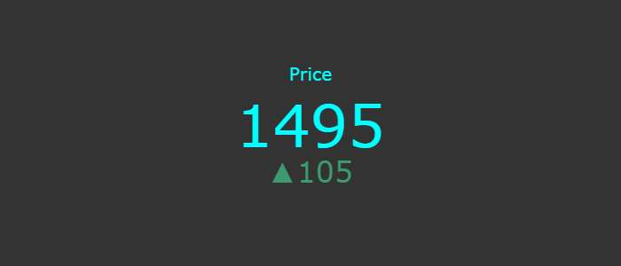
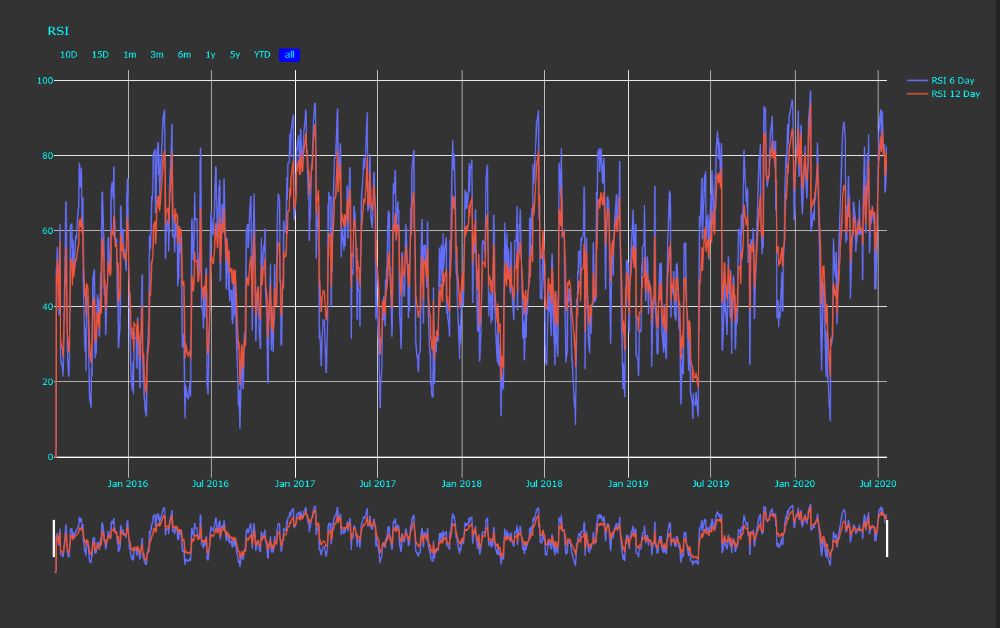

# Stock Screaner with Plotly Dash 

# Table of contents
1. [Introduction](#introduction)
2. [What is Dash ?](#Dash)
3. [Project Overview](#Overview)
4. [Requirements](#req)
5. [Demo](#Demo)
6. [Deployment](#deployment)
7. [Tools Used](#tools)
8. [Contributions](#contributions)
9. [Credits](#credits)

<br></br>


## Introduction <a name="introduction"></a>
 This project is a Interactive Stock Dashboard with [Plotly dash](https://plotly.com/dash/ "Dash documentation") with some Technical  Indicators  like RSI ,MACD  etc this is a educational project not intented to use for any commercial purposes.  

<br></br>


## What is Dash ? <a name="Dash"></a>
Dash is a productive Python framework for building web applications.
Written on top of Flask, Plotly.js, and React.js, Dash is ideal for building data visualization apps with highly custom user interfaces in pure Python. It's particularly suited for anyone who works with data in Python.
Through a couple of simple patterns, Dash abstracts away all of the technologies and protocols that are required to build an interactive web-based application. Dash is simple enough that you can bind a user interface around your Python code in an afternoon.
Dash apps are rendered in the web browser. You can deploy your apps to servers and then share them through URLs. Since Dash apps are viewed in the web browser, Dash is inherently cross-platform and mobile ready.
<br></br>


## Overview<a name  = "Overview"></a>

This project aims towards displaying the live stock values and some technical indicators that helps traders to predict the stock behavior. For now the project contains some popular indicators and i am committed todards adding more in future. 
<br></br>


## requirements<a name  = "req"></a>
Project runs on [Python 3.6.1](https://www.python.org/downloads/release/python-361/ "Download Python 3.6.1")  
and all requiremets can be installed by following command you can find requirement.txt [here](https://github.com/SampathHN/Stock_screaner_dash/blob/master/requirements.txt "requirements.txt")
```python
pip install -r requirements.txt
```
<br></br>

## Demo<a name  = "Demo"></a>
#### Available plots



#### Live price



#### Live Interactive graph 




#### Example


<br></br>


## Deployment<a name  = "deployment"></a>

Dash app can be treated as a flask app and can be directly deployed in Heroku and the server can be exposed to heroku just by adding a below code in [stock.py](https://github.com/SampathHN/Stock_screaner_dash/blob/master/stock.py "stock.py")
```python
server = app.server

```
### Checkout the app [here](https://stockdashboardlive.herokuapp.com/ "Stock screaner")
<br></br>

## Contributions <a name="contributions"></a>

Community contributions are a welcome addition to the project. In order to be merged upsteam any additions will need to be formatted with [black](https://black.readthedocs.io) for consistency with the rest of the project and pass the continuous integration tests run against the PR.

Bug reports are also welcome on the [issue page](https://github.com/SampathHN/Live-Stock-price-Dashboard/issues).
## Tools used <a name="tools"></a>


<table>
  <tr>
    <td></td>
     <td></td>
     <td></td>
  </tr>
  <tr>
    <td></td>
    <td></td>
    
  </tr>
 </table>

 
<table>
  <tr>
    <td></td>
     <td></td>
     <td></td>
  </tr>
  <tr>
    <td></td>
    
  </tr>
 </table>


 ## Credits  
 All live stock is collected by [Yahoo_fin](https://theautomatic.net/yahoo_fin-documentation/ "Yahoo_fin Documentation")  
 Technical indicators calculation is done by [stockstats](https://pypi.org/project/stockstats/ "stockstats")

